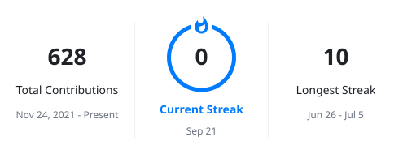

  

 

  

## 👤 About Me

AI Engineer with **2+ years** of hands-on experience delivering **production-grade Generative AI, Agentic AI, and cloud-native ML systems** across healthcare, enterprise document intelligence, and multimodal analytics — for clients in the **USA, Germany, and India**.

- 🤖 Specializing in **Agentic AI, Multi-Agent Systems, LLMs & RAG**
- ☁️ Building on **Azure AI** and **GCP Vertex AI**
- 🔧 Architecting with **LangGraph, LangChain, MCP, FastAPI**
- 📄 Expert in **Intelligent Document Processing & NL2SQL**
- 🏆 Most Valuable Player Award · Employee of the Year Award
- 📫 **pranitsawant6998@gmail.com**

 

---

## 🌐 Connect With Me

  
  
  
  

---

## 🚀 Areas of Expertise

| Domain | Skills |
|--------|--------|
| 🤖 Agentic AI | Multi-Agent Systems, Agent Orchestration, Human-in-the-Loop, Tool Calling |
| 🔗 LLM Frameworks | LangChain, LangGraph, MCP (Model Context Protocol), RAG, RAGAS |
| 📄 Document Intelligence | Azure Document Intelligence, OCR, Structured Extraction (260+ field types) |
| 💬 Conversational AI | NL2SQL, Chatbot Pipelines, Conversational Analytics |
| 👁️ Multimodal AI | Gemini Vision, Video Analytics, CCTV Intelligence, OpenCV |
| ☁️ Cloud & MLOps | Azure AI, GCP Vertex AI, Docker, Kubernetes, CI/CD |

---

## 🛠️ Tech Stack

**LLMs & GenAI**

**Agentic & RAG Frameworks**

**Cloud & Infrastructure**

**Backend & APIs**

**Databases & Vector Stores**

**ML / DL**

## 📊 GitHub Stats

  
  

## 👀 Profile Views

  

